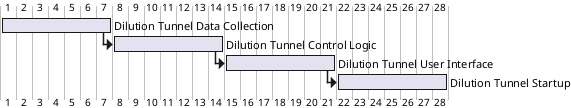

<Table contents={tableContents} />

```plantuml
  @startgantt
  [Dilution Tunnel Data Collection] as [t1] requires 7 days
  [Dilution Tunnel Control Logic] as [t2] requires 7 days
  [t2] starts at [t1]'s end
  [Dilution Tunnel User Interface] as [t3] requires 7 days
  [t3] starts at [t2]'s end
  [Dilution Tunnel Startup] as [t4] requires 7 days
  [t4] starts at [t3]'s end
  @endgantt
```